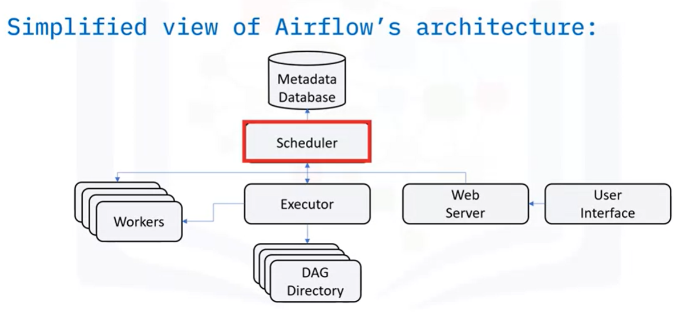
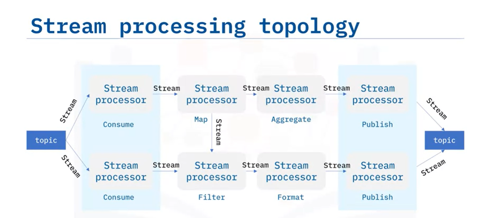

# **ETL & Data Pipelines with shell, airflow & kafka**

## **Types of pipelines**
+ Dynamic / nonlinear
+ Static / linear 

An **I/O buffer** (input/output) is a holding area for data, placed between processing stages having different or varying delays. Buffers can also be used to regulate the output of stages having variable processing rates, and thus may be used to improve throughput.

## **Stages of pipelines**
* Data extraction
* Data ingestion (into the pipeline)
* Transformation
* Loading data
* Scheduling
* Monitoring 
* Maintenance and optimization


## **Key performance indicators of pipelines**
+ **Latency**: total time it takes for a packet of data to pass through the pipeline. You can break it down to each stage of the process.

+ **Throughput**: how much data can be fed through the pipeline per unit of time. Processing larger packets per unit of time increases throughput.

## **Pipeline monitoring**

--------------------------------------------------------------------

## **Linux Commands and Shell Scripting**
A shell is a powerful user interface for Unix-like operating systems.

```shell
#Create a shell file 
touch file_name.sh

#Open the file on a text editor and type:
#The following command turns your file into a bash shell script
'#!/bin/bash' #this includes the # 

#Call the api to read data and append to a log file
get_data_api >> data.log

#Call python file to read data and write results to csv
python3 main.py data.log res_data.csv

#Load results to front end using api
load_api res_data.csv

#Set permissions to make shell script executable
chmod +x file_name.sh

#then you have to schedule the shell file on Cron
````
-----------------------------------------------------------------------

## **Apache Airflow**
Open source workflow orchestration tool to programmatically author, schedule, and monitor workflows. Monitor, schedule and manage workflows with the webapp.



A workflow is represented as a **DAG** (a Directed Acyclic Graph), and contains individual pieces of work called tasks, arranged with dependencies.

DAG definition components:
* Library imports
* DAG arguments
* DAG definition
* Task definition
* Task pipeline

**DAG definition example:**


**Main principles**
* Scalable: it uses a modular architecture and can orchestrate an aribtraty number of workers
* Dynamic: pipelines are defined in python allowing dynamic pipeline generation
* Extensible: define your operators and extend libraries to suit your environment
* Lean

Usecases
- define and organiza Machine Learning pipeline dependencies
- increase visibility of processes 
- orchestration
- scheduling 

------------------------------------------------------------------------

## **Apache Kafka**
In the context of event streaming, an event is a type of data which describes the entity’s observable state updates over time.  
Most common formats:
* Primitive (text,number,date,etc)
* Key value pair (list, tuple, json,etc)
* Key value with timestamp

Event Stream Platform (ESP)
Used to overcome the challenge of handling different event sources and destinations. An ESP acts as a middle layer among various event sources and destinations and provides a unified interface for handling event-based ETL.
Apache Kafka is an ESP.

A Kafka cluster contains one or many brokers. 

* **Brokers:** The dedicated server to receive, store, process, and distribute events.Brokers are synchronized and managed by another dedicated server called ZooKeeper. Each broker contains one or many topics. You can think of a topic as a database to store specific types of events, such as logs, transactions, and metrics, for example.
* **Topics:** The containers or databases of events.
* **Partitions:** Divide topics into different brokers. 
* **Replications:** Duplicate partitions into different brokers.
* **Producers:** Kafka client applications to publish events into topics.
* **consumers:** Kafka client applications subscribed to topics and read events from them.

**Kafka Streams API** is a simple client library aiming to facilitate data processing in event-streaming pipelines. It processes and analyzes data stored in Kafka topics, thus both the input and output of the Streams API are Kafka topics.
